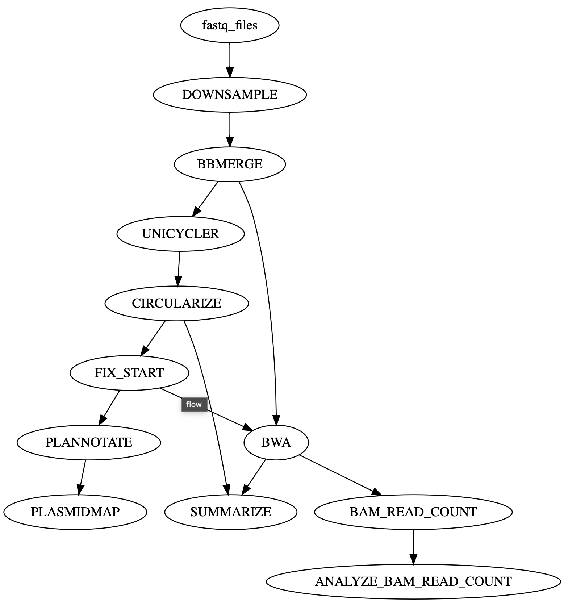

# seqWell Plasmid Assembly From Fastq Nextflow Pipeline


This is the Nextflow pipeline that does plasmid assembly from fastq files.
The pipeline uses [Unicycler](https://github.com/rrwick/Unicycler) for plasmid assembly from fastq files.
The pipeline is as shown in the image below.

The pipeline starts with fastq files and has the following steps:

1. The `DOWNSAMPLE` process optionally downsamples fastq reads.
2. The `BBMERGE` process performs fastq quality filtering, merging, and normalization of paired-end reads using BBTools. 
   First, bbduk.sh cleans the reads by trimming adapters and low-quality sequences; 
   then bbmerge-auto.sh merges overlapping read pairs; 
   finally, bbnorm.sh normalizes read coverage to reduce sequencing depth bias.
3. The `UNICYCLER` process uses Unicycler for plasmid assembly.
4. The `CIRCULARIZE` process processes .gfa graph files representing genome assemblies. 
   It filters out low-quality or disconnected contigs based on coverage and connectivity, 
   identifies the longest paths in the graph (potential assemblies),
   and outputs the best assembly paths in GFA, FASTA, and CSV formats.
5. The `FIX_START` process runs [Circlator](https://github.com/sanger-pathogens/circlator)’s fixstart on the input FASTA to reorient the circular genome sequence to a standardized origin.
6. The `PLANNOTATE` process generates a GenBank (.gbk) annotation file for assembled plasmid FASTA.
7. The `PLASMIDMAP` process creates plasmid maps from GenBank annotation files.
8. The `BWA` process indexes the provided reference FASTA (if non-empty), aligns the input FASTQ reads to it with bwa mem, 
   converts and sorts the alignments into a BAM file, then computes overall read counts, per-base depth CSVs, and a detailed position-by-position coverage file.
9. The `BAM_READ_COUNT` process runs bam-readcount on the BAM files using the assembled FASTA and writes the per-base read count output.
10. The `ANALYZE_BAM_READ_COUNT` process starts with `BAM_READ_COUNT` outputs and caculates matching versus mismatching reads relative to the assembled plasid FASTA.
11. The `SUMMARIZE` process creates a summary in csv format for the assembly pipeline. 


The final output from this pipeline includes:

1. normalized merged fastq
2. assembled FASTA 
3. assembled GFA
4. coverage plot 
5. GenBank file
6. plasmid map
7. per base data
8. assembly summary




## Dependencies

This pipeline requires installation of [Nextflow](https://www.nextflow.io/docs/latest/install.html).
It also requires installation of a containerization platform such as [Docker](https://docs.docker.com/engine/install/).

## Docker Containers

All docker containers used in this pipeline are publicly available.

- *DOWNSAMPLE*: seqwell/seqtk:v1.0
- *BBMERGE*: seqwell/fq_assemble:v1.0
- *UNICYCLER*: seqwell/seqtk:v1.0
- *CIRCULARIZE*: seqwell/python:v1.0
- *BWA*: seqwell/fq_assemble:v1.0
- *BAM_READ_COUNT*: seqwell/fq_assemble:v1.0
- *PLANNOTATE*: seqwell/fq_assemble:v1.0
- *FIX_START*: seqwell/fq_assemble:v1.0
- *SUMMARIZE*: 'seqwell/python:v1.0'
- *ANALYZE_BAM_READ_COUNT*: rocker/tidyverse:latest
- *PLASMIDMAP*: rocker/tidyverse:latest
 
            
            
# How to run the pipeline:

## Required Parameters

The required parameters are *input*, and *output*.
The optional parmater are *downsample*, the reads pair that user likes to downsample the reads to. Default is no downample. 

### `input`
The input fastq data directory path can be a local absolute path or an AWS S3 URI.
If it is an AWS S3 URI, please make sure to [set your security credentials appropriately](https://www.nextflow.io/docs/latest/amazons3.html#security-credentials).


### `output`

The output directory path can be a local absolute path or an AWS S3 URI.
If it is an AWS S3 URI, please make sure to [set your security credentials appropriately](https://www.nextflow.io/docs/latest/amazons3.html#security-credentials).

## Profiles:

Several profiles are available and can be selected with the `-profile` option at the command line.

- `apptainer`
- `aws`
- `docker`
- `singularity`

## Example Command

A minimal execution might look like:

```bash
nextflow run \
    -profile docker \
    main.nf \
    --input ${PWD}/path/to/fastq \
    --output ${PWD}/path/to/output_dir \
    -resume  -bg 
```

# Running Test Data

## With Docker

The pipeline can be run using included test data with:

```bash
nextflow run \
    -profile docker \
    main.nf \
    --input "${PWD}/tests/fastq" \
    --output "${PWD}/test_output" \
    -resume  -bg 
```
The above bash code is saved in the file *nextflow.sh*.  When you get this repo, you can do a quick test by run *bash nextflow.sh*.


## Expected Outputs
```
└── assembly_out
    ├── assembly-report-2025-04-14-19-19.csv
    ├── COVERAGE
    │   ├── C1003PLT2_A01.png
    │   └── C1003PLT2_A02.png
    ├── FASTA
    │   ├── C1003PLT2_A01.final.fasta
    │   └── C1003PLT2_A02.final.fasta
    ├── GBK
    │   ├── C1003PLT2_A01.gbk
    │   └── C1003PLT2_A02.gbk
    ├── GFA
    │   ├── C1003PLT2_A01.final.gfa
    │   └── C1003PLT2_A02.final.gfa
    ├── norm_fastq
    │   ├── C1003PLT2_A01.norm.merged.fq
    │   └── C1003PLT2_A02.norm.merged.fq
    ├── per_base_data
    │   ├── per_base_data_C1003PLT2_A01.csv
    │   └── per_base_data_C1003PLT2_A02.csv
    └── plasmidMap
        ├── C1003PLT2_A01.plasmidMap.png
        └── C1003PLT2_A02.plasmidMap.png
```
